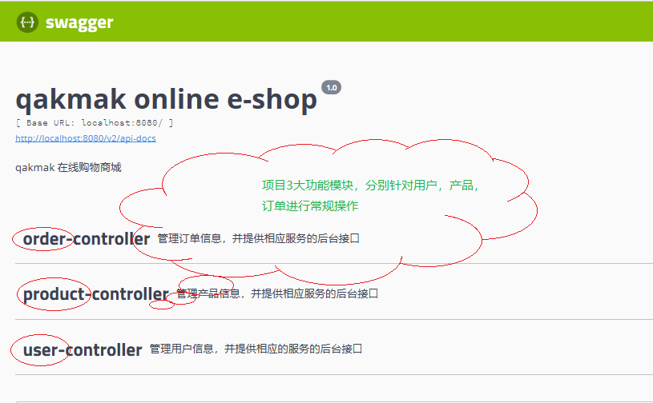
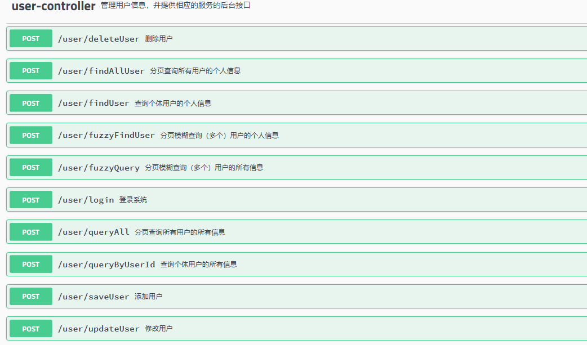
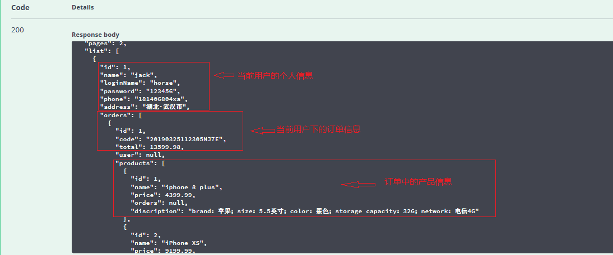

# 分享一个入门级微服务项目：online-shop
SpringBoot框架使用了默认大于配置的理念，集成了快速开发的Spring多个插件，同时自动过滤掉了不需要配置的多余的插件。简化了项目的开发配置流程，一定程度上取消了xml配置，是一套快速配置开发的脚手架。还有SpringBoot的另外一个特点是其更专注于开发微服务后台接口，虽然前端视图也能开发，但那个有点不符合SpringBoot的初衷了，因此SpringBoot更适合于开发可以独立运行的单体微服务后台接口。
而这也是笔者为什么做这个项目的初衷之一。

**如果各位猿友觉得还不错的话，就点击一下右上角的star鼓励一下呗(#^.^#)**

**技术栈**

* 后端： SpringBoot2.x + Mybatis
* 前端： thymeleaf html/(Vue.JS2.x + ElementUI)
* 备注： 前端暂时不提供访问页面，后续会补

**测试环境**

* IDEA + SpringBoot + mysql + jdk8 + maven + Swagger2

**启动说明**

* 启动前，请配置好 [application.yml](https://github.com/uboy25/online-shop/blob/master/src/main/resources/application.yml) 中连接数据库的用户名和密码。

* 启动前，请创建数据库`eshop`，建表SQL语句放在：[/db/](https://github.com/uboy25/online-shop/tree/master/db)。具体的建表和建库语句请仔细看SQL文件。

* 配置完成后，运行位于 `src/main/java/com/qakmak/eshop/`下的AppRun.java中的main方法，访问 `http://localhost:8080/swagger-ui.html#/` 进行API测试。

**项目结构**
```
.
├─ .idea
├─ db --数据表sql文件
├─ src --源代码资源文件目录
├─ preview --存放项目运行效果预览图
|     ├─ 1.png --项目3大核心模块视图
|     ├─ 2.png --订单和产品核心功能API
|     ├─ 3.png --用户核心功能API
|     ├─ 4.png --queryAll方法查询结果视图，即用来查询所有用户的所有信息（包括用户名下的订单，产品信息）
│  ├─ docs --存放文档
│  │  └─ markdown --通过markdown插件生成的一种API文档
│  └─ main
│      ├─ java
│      │  └─ com
│      │      └─ qakmak
│      │          └─ eshop
│      │              ├─ common --实体类
│      │              ├─ config --存放Swagger工具的配置类
│      │              ├─ controller --后端控制器
│      │              ├─ dao --MyBatis的接口
│      │              ├─ interceptor --自定义拦截器
│      │              ├─ service --业务层
|      |              ├─ AppRun.java --项目的启动器类
│      │              └─ utils --工具类
│      └─ resources --资源文件目录
│          ├─ mapper --MyBatis的映射文件
│          ├─ static  -- 前端静态文件（主要是JS、CSS、Image文件，一般不放HTML页面）
│          │  ├─ css --CSS样式文件目录
│          │  ├─ image --图片资源文件目录
│          │  └─ js --JS文件目录
│          └─ templates --受保护的页面目录，该目录下的页面只能通过对于的Controller类映射后才能被访问，不能被浏览器直接访问的
└─target --存放了一些经编译后的一些文档，请参考上面的目录备注，没有实际意义
    ├─classes
    │  ├─com
    │  │  └─qakmak
    │  │      └─eshop
    │  │          ├─common
    │  │          ├─config
    │  │          ├─controller
    │  │          ├─dao
    │  │          ├─interceptor
    │  │          ├─service
    │  │          └─utils
    │  └─mapper
    └─generated-sources
        └─annotations
```

## Spring Boot应用启动器

Spring Boot提供了很多应用启动器，分别用来支持不同的功能，说白了就是`pom.xml`中的依赖配置，因为Spring Boot的自动化配置特性，我们并不需再考虑项目依赖版本问题，使用Spring Boot的应用启动器，它能自动帮我们将相关的依赖全部导入到项目中。

我们这里介绍几个常见的应用启动器：

* `spring-boot-starter`: Spring Boot的核心启动器，包含了自动配置、日志和YAML
* `spring-boot-starter-aop`: 支持AOP面向切面编程的功能，包括spring-aop和AspecJ
* `spring-boot-starter-cache`: 支持Spring的Cache抽象
* `spring-boot-starter-artermis`: 通过Apache Artemis支持JMS（Java Message Service）的API
* `spring-boot-starter-data-jpa`: 支持JPA
* `spring-boot-starter-data-solr`: 支持Apache Solr搜索平台，包括spring-data-solr
* `spring-boot-starter-freemarker`: 支持FreeMarker模板引擎
* `spring-boot-starter-jdbc`: 支持JDBC数据库
* `spring-boot-starter-Redis`: 支持Redis键值储存数据库，包括spring-redis
* `spring-boot-starter-security`: 支持spring-security
* `spring-boot-starter-thymeleaf`: 支持Thymeleaf模板引擎，包括与Spring的集成
* `spring-boot-starter-web`: 支持全栈式web开发，包括tomcat和Spring-WebMVC
* `spring-boot-starter-log4j`: 支持Log4J日志框架
* `spring-boot-starter-logging`: 引入Spring Boot默认的日志框架Logback

## Spring Boot项目结构设计

Spring Boot项目（即Maven项目），当然拥有最基础的Maven项目结构。除此之外：

1. Spring Boot项目中不包含webapp(webroot)目录。
2. Spring Boot默认提供的静态资源目录需要置于classpath下，且其下的目录名称要符合一定规定。
3. Spring Boot默认不提倡用XML配置文件，主张使用YML作为配置文件格式，YML有更简洁的语法。当然也可以使用.properties作为配置文件格式。
4. Spring Boot官方推荐使用Thymeleaf作为前端模板引擎，并且Thymeleaf默认将templates作为静态页面的存放目录（由配置文件指定）。
5. Spring Boot默认将`resources`作为静态资源的存放目录，存放前端静态文件、项目配置文件。

6. Spring Boot规定`resources`下的子级目录名要符合一定规则，一般我们设置`resources/static`为前端静态（JS,CSS）的存放目录；设置`resources/templates`作为HTML页面的存放目录。

7. Spring Boot指定的Thymeleaf模板引擎文件目录`/resources/templates`是受保护的目录，这与之前的WEB项目的WEB-INF文件夹和类似，特点就是里面的静态资源不能直接访问，一般我们通过Controller映射访问。

8. 建议将Mybatis-Mapper的XML映射文件放于`resources/`目录下，我这里设为`resources/mapper`目录，且`src/main/java/Dao`下存放mapper目录下的各个MyBatis映射文件里的接口。详情请看：[mapper/](https://github.com/uboy25/online-shop/tree/master/src/main/resources/mapper)里的映射文件。
特别提示：xxMapper.xml文件里namespace的值必须是`dao/`目录下对应的映射类路径，不然找不到接口就报错。

9. `AppRun.java`为项目的启动器类，项目不需要部署到Tomcat上，由SpringBoot提供的服务器部署项目（运行启动器类即可）；且SpringBoot会自动扫描该启动器同级和子级下用注解标识的Bean，也就是之前我们配置的`<context:component-scan>`在SpringBoot中是完全不需类似的配置的。

10. Spring Boot不建议使用JSP页面，如果想使用，请自行百度解决办法。我们常用HTML页面+Thymeleaf模板引擎。Thyemeleaf模板引擎提供了很多内置语法，比如：可以通过`<div th:text="${xx}">`取出来后端存放在域对象中的数据。

## 项目依赖

本项目的依赖文件请看Github仓库：[online-shop/pom.xml](https://github.com/uboy25/online-shop/blob/master/pom.xml)

## 初始化数据库

本项目数据库表设计请看GitHub仓库：[online-shop/db/](https://github.com/uboy25/online-shop/tree/master/db)

请运行项目前，先把数据库表结构建好。

## SpringBoot整合Mybatis：
### 整合配置文件

本例详细代码请看GitHub仓库：[online-shop/resources/application.yml](https://github.com/uboy25/online-shop/blob/master/src/main/resources/application.yml)

配置文件具体内容如下：
```
#Spring配置
spring:
  # 数据库连接池配置
  datasource:
    name: eshop
    type: com.alibaba.druid.pool.DruidDataSource
    driverClassName: com.mysql.jdbc.Driver
    url: jdbc:mysql://localhost:3306/eshop?useUnicode=true&characterEncoding=utf8&useSSL=false&serverTimezone=Hongkong
    username: root
    password: root
    initialSize: 2
    #获取连接等待超时时间
    maxWait: 60000
    #配置初始化大小/最小/最大
    initial-size: 1
    min-idle: 1
    max-active: 20
    #间隔多久进行一次检测，检测需要关闭的空闲连接
    timeBetweenEvictionRunsMillis: 60000
    minEvictableIdleTimeMillis: 300000
    testWhileIdle: true
    testOnBorrow: false
    testOnReturn: false
    poolPreparedStatements: true
    maxOpenPreparedStatements: 50
    
# 数据映射配置
mybatis:
  configuration:
    map-underscore-to-camel-case: true
  mapper-locations: classpath:mapper/*.xml  #注意这个mapper地址，不能随便指定，
  type-aliases-package: com.qakmak.eshop.common #实体类映射路径
  
```
**注意：空格代表节点层次；注释部分用`#`标记**

**解释**

1. 我们实现的是spring-mybatis的整合，包含mybatis的配置以及datasource数据源的配置当然属于spring配置中的一部分，所以需要在`spring:`下。

2. `mapper-locations`相当于XML中的`<property name="mapperLocations">`用来扫描Mapper层的配置文件，由于我们的配置文件在`resources`下，所以需要指定`classpath:`。

3. `type-aliases-package`相当与XML中`<property name="typeAliasesPackase">`别名配置，一般取其下实体类类名作为别名。

4. `datasource`数据源的配置，`name`表示当前数据源的名称，类似于之前的`<bean id="dataSource">`id属性，这里可以任意指定，因为我们无需关注Spring是怎么注入这个Bean对象的。

5. `druid`代表本项目中使用了阿里的druid连接池，`driver-class-name:`相当于XML中的`<property name="driverClassName">`；`url`代表XML中的`<property name="url">`；`username`代表XML中的`<property name="username">`；`password`代表XML中的`<property name="password">`；其他druid的私有属性配置不再解释。这里注意druid连接池和c3p0连接池在XML的<property>的name中就不同，在此处SpringBoot的配置中当然名称也不同。


如果Spring整合Mybtis的配置你已经很熟悉了，那么这个配置你肯定也很眼熟，从英文名称上就很容易区分出来。这里需要注意的就是YAML语法规定不同行空格代表了不同的层级结构。

## SpringBoot配置Swagger：
本例详细代码请看GitHub仓库：[config/SwaggerConfiguration.java](https://github.com/uboy25/online-shop/blob/master/src/main/java/com/qakmak/eshop/config/SwaggerConfiguration.java)

配置文件具体内容如下：
```
package com.qakmak.eshop.config;

import org.slf4j.Logger;
import org.slf4j.LoggerFactory;
import org.springframework.context.annotation.Bean;
import org.springframework.context.annotation.Configuration;
import org.springframework.http.ResponseEntity;
import org.springframework.util.StopWatch;
import springfox.documentation.builders.PathSelectors;
import springfox.documentation.builders.RequestHandlerSelectors;
import springfox.documentation.service.ApiInfo;
import springfox.documentation.spi.DocumentationType;
import springfox.documentation.spring.web.plugins.Docket;
import springfox.documentation.swagger2.annotations.EnableSwagger2;

import java.util.Date;
import java.util.LinkedList;

/**
 * swagger2
 * @author tapakkur
 * @date 2019/2/16
 */
@Configuration // 配置
@EnableSwagger2 // 让swagger启动
public class SwaggerConfiguration {

    private static Logger logger = LoggerFactory.getLogger(SwaggerConfiguration.class);

    @Bean
    public Docket swaggerSpringfoxDocket() {
        logger.info("Starting Swagger");
        StopWatch watch = new StopWatch();
        watch.start();
        ApiInfo apiInfo = new ApiInfo(
                "qakmak online e-shop",
                "qakmak 在线购物商城",
                "1.0",
                null,
                null,
                null,
                null,
                new LinkedList<>());

        Docket docket = new Docket(DocumentationType.SWAGGER_2)
                .apiInfo(apiInfo)
                .forCodeGeneration(true)
                .enable(true)
                .genericModelSubstitutes(ResponseEntity.class)
                .ignoredParameterTypes(java.sql.Date.class)
                .directModelSubstitute(java.time.LocalDate.class, java.sql.Date.class)
                .directModelSubstitute(java.time.ZonedDateTime.class, Date.class)
                .directModelSubstitute(java.time.LocalDateTime.class, Date.class)
                .select()
                // 别忘了修改基础包路径
                .apis(RequestHandlerSelectors.basePackage("com.qakmak.eshop.controller"))
                .paths(PathSelectors.any())
                .build();
        watch.stop();
        logger.info("Started Swagger in {} ms", watch.getTotalTimeMillis());
        return docket;
    }
}


```


既然完成了SpringBoot-Mybatis-Swagger 的基本配置，下面我们实战讲解如何实现基本的CRUD。
（由于篇幅缘故，本次主要选择用户类作为讲解对象，其他订单，产品不再讲解 ！）

### 实体类
源码github地址：[common/User.java](https://github.com/uboy25/online-shop/blob/master/src/main/java/com/qakmak/eshop/common/User.java)

```
public class User implements Serializable {

    private Integer id;
    private String name;
    private String loginName;
    private String password;
    private String phone;
    private String address;
    private List<Order> orders;
    
    // 省略构造函数，getter，setter
```

### MyBatis接口
源码GitHub地址：[dao/UserDao](https://github.com/uboy25/online-shop/blob/master/src/main/java/com/qakmak/eshop/dao/UserDao.java)

```
package com.qakmak.eshop.dao;

import com.qakmak.eshop.common.User;

import java.util.List;

/**
 * @author tapakkur
 * @ProjectName eshop
 * @Date 2019/2/16 19:57
 */

public interface UserDao {

    void saveUser(User user); // 添加用户

    void deleteUser(int userId); // 删除用户

    void updateUser (User user); // 修改用户

    User queryByUserId(int userId); // 查询用户的（所有）信息

    User queryByLoginName(String loginName); // 用于登录验证

    User findUser(Integer userId); // 查询用户的信息

    List<User> queryAll(); // 查询（所有）用户的（所有）信息

    List<User> findAllUser(); // 查询（所有）用户的信息

    List<User> fuzzyQuery(String userName); // 模糊查询用户的（所有）信息

    List<User> fuzzyFindUser(String userName); // 模糊查询用户的信息

}

```

### 业务服务层：UserService
源码GitHub地址：[service/UserService.java](https://github.com/uboy25/online-shop/blob/master/src/main/java/com/qakmak/eshop/service/UserService.java)

```
package com.qakmak.eshop.service;

import com.github.pagehelper.PageInfo;
import com.qakmak.eshop.common.User;

/**
 * @author tapakkur
 * @ProjectName eshop
 * @Date 2019/2/24 1:03
 */
public interface UserService {

    void saveUser(User user);
    void deleteUser(int userId);
    void updateUser(User user);
    User queryByUserId(int userId);
    User queryByLoginName(String loginName);
//    User checkLogin(String loginName, String password);
    User findUser(Integer userId);
    PageInfo<User> queryAll(Integer page, Integer pageSize);
    PageInfo<User> findAllUser(Integer page, Integer pageSize);
    PageInfo<User> fuzzyQuery(String key,Integer page, Integer pageSize);
    PageInfo<User> fuzzyFindUser(String userName,Integer page, Integer pageSize);

}

```
### 服务层之 UserServiceImpl：
源码GitHub地址：[service/UserServiceImpl.java](https://github.com/uboy25/online-shop/blob/master/src/main/java/com/qakmak/eshop/service/UserServiceImpl.java)
**因篇幅过大，因此之举其中的 PageInfo<User> queryAll(Integer page, Integer pageSize)方法**
    
```
@Override
    public PageInfo<User> queryAll(Integer page, Integer pageSize) {
        List<User> resultList = userDao.queryAll(); // 查询用户信息的结果
        Integer count = resultList.size();
        //封装返回结果
        Page<User> pageSetting = new Page<>(page,pageSize);
        pageSetting.setTotal (count);
        PageInfo<User> pageInfo = new PageInfo<>( pageSetting);
        pageInfo.setList(resultList);
        return pageInfo;
    }
```

### 后端控制层：UserController
源码GitHub地址：[controller/UserController.java](https://github.com/uboy25/online-shop/blob/master/src/main/java/com/qakmak/eshop/controller/UserController.java)
**因篇幅过大，因此之举其中的 PageInfo<User> queryAll(Integer page, Integer pageSize) 方法**
    
```
@ApiOperation(value = "分页查询所有用户的所有信息", notes = "分页查询所有用户的所有信息（包括订单，产品信息）")
    @ApiImplicitParams({
        @ApiImplicitParam(paramType = "query", name = "page", value = "当前页", defaultValue = "1"),
        @ApiImplicitParam(paramType = "query", name = "pageSize", value = "每页显示的记录数", defaultValue = "10")
    })
    @RequestMapping(value = "/queryAll", method = RequestMethod.POST)
    public PageInfo<User> queryAll(
        @RequestParam(value = "page") Integer page,
        @RequestParam(value = "pageSize") Integer pageSize
    ){
        return userService.queryAll(page, pageSize);
    }
    
```

# 预览效果视图
接下来看一下整个项目运行之后，访问微服务的后台API测试地址： http://localhost:8080/swagger-ui.html#/ 之后的效果图：

* 项目3大核心模块视图

* 订单和产品模块的核心API

* 用户模块的核心API

* 测试 queryAll 方法之后，后台从数据库获取到的数据



# ---------------------Welcome to your valuable suggestions------------------------------------
#------------------------------------The End---------------------------------------------------
